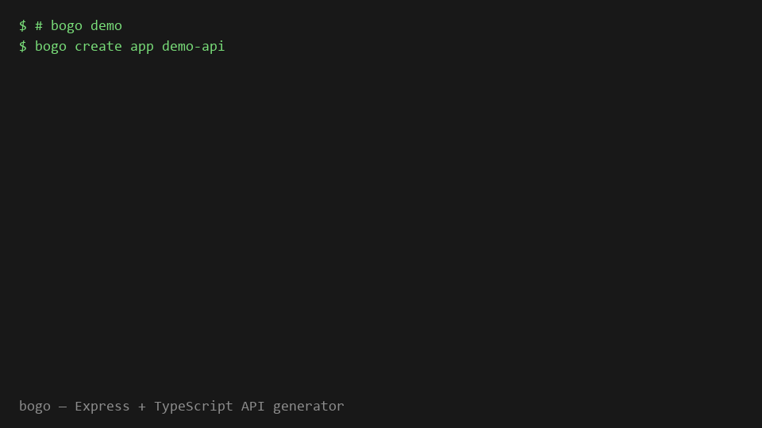

# @bogomolcompany/bogo

[](https://www.npmjs.com/package/@bogomolcompany/bogo)
[](https://www.npmjs.com/package/@bogomolcompany/bogo)
[](https://github.com/bogomolcomp/bogo/blob/main/LICENSE)

[Русская версия / Russian version](README.ru.md)

**`bogo create app`** — Express + TypeScript project in 10 seconds.  
**`bogo g users`** — controller, service, dto, routes, validator in one command.  
**`bogo r users`** — remove a module and clean up the index file.

CLI generator for Express API. Works in any repository — configured via `.bogorc.json`.



## Quick start

```bash
npx @bogomolcompany/bogo create app
cp .env.example .env
npm install
npm run dev

npx bogo g users -m getList -m createUser
```

## Why bogo

| | NestJS CLI | express-generator | **bogo** |
|---|:---:|:---:|:---:|
| Express without a framework | — | ✓ | ✓ |
| TypeScript out of the box | ✓ | — | ✓ |
| DTO + Zod validator | ✓ | — | ✓ |
| Starter project (server, logger, middleware) | partial | — | ✓ |
| Minimal dependencies | — | ✓ | ✓ |
| Generate into an existing project | ✓ | — | ✓ |

bogo is for teams using plain Express + TypeScript who are tired of copying the same file structure every time.

## Installation

```bash
npm install -g @bogomolcompany/bogo
# or locally
npm install --save-dev @bogomolcompany/bogo
npx bogo --help
```

From source:

```bash
git clone https://github.com/bogomolcomp/bogo.git
cd bogo
npm install
npm run build
npm link
```

## Create a new project

```bash
bogo create app my-api --with-docker --with-eslint
```

Or into a subdirectory:

```bash
bogo create app my-api
cd my-api
```

Creates:

```
package.json
tsconfig.json
.env.example
.bogorc.json
src/
  index.ts
  types/express.d.ts
  middlewares/
    logger.ts
    formatResponse.ts
    validate.ts
  utils/
    getAllowedIps.ts
  api/
```

Includes: dotenv, body-parser, logger, formatResponse, IP whitelist (`ALLOWED_IPS`), `/health`, global error handler.

```bash
cp .env.example .env
npm install
npm run dev
```

## Init in an existing project

```bash
cd /path/to/your-express-app
bogo init
```

Creates `.bogorc.json`:

```json
{
  "apiDir": "src/api",
  "indexFile": "src/index.ts",
  "routePrefix": "/api",
  "templatesDir": "./bogo-templates"
}
```

`templatesDir` is optional. Place `controller.template`, `service.template`, etc. to override built-in templates.

## Generate a module

```bash
bogo g analytics -m getStats -m getReport
bogo g orders -m createOrder:POST:/create -m getOrder:GET:/:id
bogo g posts -m getList:GET:/list -w auth
```

Creates:

```
src/api/analytics/
  analytics.controller.ts
  analytics.service.ts
  analytics.dto.ts
  analytics.validator.ts
  analytics.routes.ts
```

Automatically appends import and `app.use` to `src/index.ts` when the file exists.

## Generate a single file

```bash
bogo g controller users -m getList
bogo g service users -m getList
bogo g dto users -m getList -m createUser
bogo g validator users -m getList
bogo g routes users -m getList:/list
```

Parts: `controller`, `service`, `dto`, `validator`, `routes`.

The module folder is created if it does not exist. Generating `routes` updates the index file the same way as a full module.

```bash
bogo r controller users
bogo r routes users
```

## Add a method to an existing module

```bash
bogo g method users -m getList
bogo g method users -m createUser -m updateUser:/:id
```

Adds the method to all existing module files: controller, service, dto, validator, routes.

Specific parts only:

```bash
bogo g method users -m getList -p controller
bogo g method users -m getList -p controller -p service -p dto
```

`-m` is required. `-p` is optional — without it, all found files are updated.

## Remove a method

```bash
bogo r method users -m getList
bogo r method users -m createUser -p controller -p service
```

## List modules

```bash
bogo list
```

## Doctor

```bash
bogo doctor
```

Checks `.bogorc.json`, index file, api directory, and required middleware.

## Interactive mode

```bash
bogo g --interactive
```

## Remove a module

```bash
bogo r analytics
bogo r orders --skip-index
```

Removes the module folder and cleans up import + `app.use` in the index file.

## Method spec format

| Example | Result |
|---------|--------|
| `getList` | POST `/get-list` |
| `getList:GET` | GET `/get-list` |
| `getOrder:GET:/:id` | GET `/:id` |
| `createOrder:POST:/create` | POST `/create` |

## Options

| Flag | Description |
|------|-------------|
| `-m, --method` | Method spec (repeatable). See table above |
| `-p, --part` | Target a specific part |
| `-w, --middleware` | Route middleware name (repeatable) |
| `-i, --interactive` | Interactive generate |
| `--dry-run` | Preview changes without writing |
| `--force` | Overwrite existing files |
| `--skip-index` | Do not patch the index file |
| `--with-docker` | Add Docker files to `create app` |
| `--with-eslint` | Add ESLint to `create app` |

## Target project requirements

- Express + TypeScript
- Zod for validation
- `validate` middleware at `src/middlewares/validate`
- `res.success` / `res.error` via response middleware

`bogo create app` scaffolds all of the above.

## Development

```bash
npm run build
npm test
npm run dev -- create app ./tmp-app --with-eslint
npm run dev -- g test -m getList:GET
npm run dev -- g method test -m createUser
npm run dev -- r method test -m createUser
npm run dev -- list
npm run dev -- doctor
```

## Links

- npm: https://www.npmjs.com/package/@bogomolcompany/bogo
- GitHub: https://github.com/bogomolcomp/bogo
- Issues / feedback: https://github.com/bogomolcomp/bogo/issues

## Publish

```bash
npm publish --otp=YOUR_CODE
```

## License

MIT
